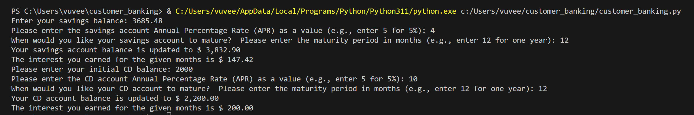

# customer_banking
This is my homework assignment for Week 3 - Module 3 Challenge. This project simulates interest calculations for banking accounts such as savings accounts and CD accounts.

## **Goal**: 

This app allows users to calculate and track interest earned on savings and CD (Certificate of Deposit) accounts. By running this application, users will be able to:

- Enter their savings and CD account information.

- See the interest earned over a specified number of months.

- View the updated balances after interest is applied.

---

## Project Structure

```bash
customer_banking
|_ Accounts.py          # Base class for Accounts
|_ savings_account.py   # Class for handling savings account logic
|_ cd_account.py        # Class for handling CD account logic
|_ customer_banking.py  # Main application
```

---

## Tasks

1. **Savings Account:**

- Prompt the user to enter the savings account balance, interest rate, and the number of months.

- Create a savings account balance, calculate the interest rate earned, and update the balance accordingly.

- Display the updated balance and the total interest earned for the savings account.

2. **CD Account:**

- Prompt the user to enter the CD account balance, interest rate, and the number of months.

- Create a CD account, calculate the interest earned, and update the balance by adding the earned interest.

- Display the updated balance and total interest earned for the CD account. 

---

## Installation

To run this application, ensure you have Python installed (version 3.8 or higher). Follow these steps:

1.  Clone the repository:

```bash
    git clone https://github.com/yourusername/customer_banking.git
```

2. Navigate to the project directory:

```bash
    cd customer_banking
```

3. Run the application
```bash
    python customer_banking.py
```

---

## Usage

When running the program, the user will be prompted to input their account details (balance, interest rate, and time in months). The program will then calculate the interest and display the updated balances for both savings and CD accounts.

---

## Results 

**Test Run Example:**

Here is an example output when running the program:



This screenshot shows how the updated balances and interest earned are displayed to the user after entering account information.